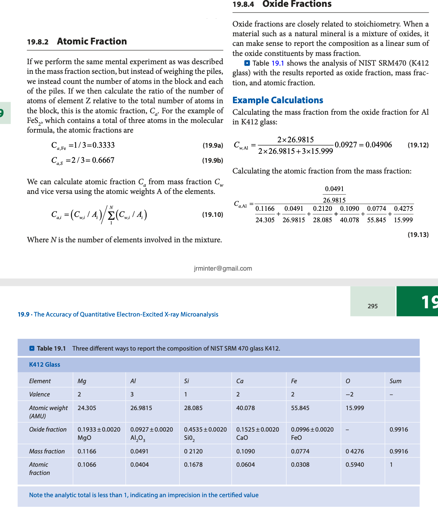

```{r setup, include=FALSE}
knitr::opts_chunk$set(echo = TRUE, comment=NA)
library(readr)
library(here)
library(kableExtra)
```

# Introduction

```{r whereami}
here::here()
```


The purpose of this analysis is to compute the composition of K-530 from oxide
fractions following an example of NIST SRM 470 (K412 glass) from Goldstein
(see below). Note that John Fournelle described this work in Fournelle2019a and Fournelle 2019b.



We need to make a similar table for K-530

```{r loadMassFracFromCsv}
base_path <- here::here()

pa <- paste0(base_path,"/csv/NIST_K530_mf.csv")

k530_df <- read_csv(pa)
kable(k530_df)

```


